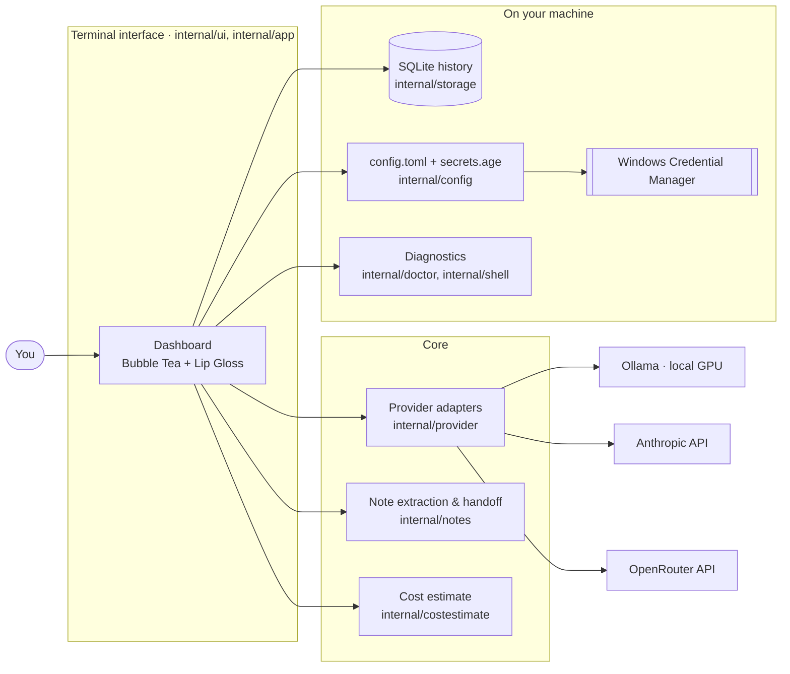

<div align="center">

# llmctl

**One terminal dashboard for every LLM you use — switch providers mid-conversation without paying to replay it.**

[](https://github.com/Dolmaa24/llmctl/actions/workflows/ci.yml)


<!-- Banner / demo: replace with a recording of the dashboard in Windows Terminal -->


*Capstone Project DSN4091 · Team No. 260 · VIT Bhopal University*

</div>

---

> [!NOTE]
> **Status: integration in progress.** The foundation, the Ollama adapter and `llmctl doctor`
> are on `main`. The dashboard, storage, note extraction and the hosted-provider adapters are in
> open pull requests and are being joined up for the v1 demo, which runs locally on Windows. The table under
> [Features](#-features) shows where each piece lives today.

## 📖 Why llmctl

Working with several LLM providers means juggling keys, endpoints and environment variables,
and every time you switch model mid-task you either lose the conversation or resend all of it.
Replaying a long transcript to a new model is slow and expensive, and a local model may not even
fit it in its context window.

llmctl keeps your providers in one encrypted place, lets you switch with a single keystroke, and
carries the conversation across as **structured notes** instead of the full transcript. Before you
confirm a switch, it shows you what each option will cost in tokens.

## ✨ Features

| | Feature | Where it is |
|---|---|---|
| 🖥️ | **Five-pane dashboard** — providers, transcript, notes, diagnostics status bar and composer | PR #1 |
| 🔀 | **One-keystroke switching** with a token-cost comparison before you confirm | PR #1 |
| 🔐 | **Encrypted keys** — `age`-encrypted at rest, passphrase in Windows Credential Manager, never drawn on screen | PR #1, PR #5 |
| ✅ | **Validated providers** — a new key is checked before it's saved, with a specific reason when it fails | PR #1 |
| 🗑️ | **Safe removal** — deleting a provider needs an explicit `y`; Enter does nothing | PR #1 |
| 📤 | **Export** a session as Markdown or JSON; existing files are never overwritten | PR #1, PR #5 |
| 🦙 | **Local models via Ollama** — `num_ctx`, `keep_alive`, timing stats, and a clear refusal instead of silent truncation | `main` |
| ☁️ | **Hosted models** via Anthropic and OpenRouter | PR #7 |
| 🩺 | **`llmctl doctor`** — WSL, network, Ollama, GPU and per-provider auth checks | `main` |
| 🗒️ | **Context handoff** — notes extracted from the conversation replace full-history replay | PR #4 |
| 💾 | **Session history** in SQLite, pure Go, no C toolchain needed | PR #5 |

## 🚀 Quick start

### Requirements

- Windows 10/11 (build 19041+). WSL2 is needed for the shell and diagnostics features.
- [Go 1.25+](https://go.dev/dl/)
- [Ollama](https://ollama.com/download) for local models (optional, but the demo uses it)

### Build and run (PowerShell)

```powershell
git clone https://github.com/Dolmaa24/llmctl.git
```

```powershell
cd llmctl
go build -o bin\llmctl.exe .\cmd\llmctl
```

```powershell
.\bin\llmctl.exe
```

### Build and run (macOS, Linux or WSL)

```bash
make build && ./bin/llmctl
```

### Pull a local model

```bash
ollama pull gemma3
```

> [!TIP]
> Run llmctl in **Windows Terminal**. It takes Alt+Enter for full screen by default, so llmctl
> uses **Ctrl+J** for a newline in the composer.

## 🏗️ Architecture

llmctl is a single Go binary with no CGO. Modules talk to each other only through the interfaces
in [`llmctl_API_INTERFACE_CONTRACT.md`](llmctl_API_INTERFACE_CONTRACT.md), so each one can be built
and tested on its own against the mocks in `internal/mock`.



| Layer | Technology |
|---|---|
| Language | Go 1.25, `CGO_ENABLED=0` |
| Terminal UI | Bubble Tea, Bubbles, Lip Gloss |
| Storage | SQLite via `modernc.org/sqlite`, embedded migrations |
| Configuration | TOML |
| Secrets | `age` encryption, passphrase in the OS keyring |
| Providers | Ollama (local), Anthropic, OpenRouter |
| CI | GitHub Actions on Windows, Ubuntu and macOS, plus a zero-CGO cross-compile |

Only `internal/shell` and `internal/doctor` may branch on the operating system.
`scripts/check_os_isolation.sh` enforces that in CI.

### Repository layout

| Path | Contents |
|---|---|
| `cmd/llmctl/` | Entrypoint and subcommands |
| `internal/app/`, `internal/ui/` | The dashboard: root model and panes |
| `internal/session/` | Canonical types: `Message`, `Session`, `Note`, `SwitchEvent` |
| `internal/provider/` | The `Adapter` interface and per-provider implementations |
| `internal/notes/` | Note extraction for context handoff |
| `internal/costestimate/` | Token counting for the switch comparison |
| `internal/storage/` | SQLite repositories and embedded migrations |
| `internal/config/` | TOML config and the encrypted secret store |
| `internal/shell/`, `internal/doctor/` | Shell detection, env rendering and diagnostics (OS-specific) |
| `internal/mock/` | Contract-conforming mocks for every interface |
| `eval/` | Benchmark corpus, comparison arms and analysis |

## ⚙️ Configuration

There is **no `.env` file**. API keys are entered in the dashboard and stored encrypted, so they
never sit in plain text on disk or in your shell history. llmctl keeps three files in its config
directory:

| File | Holds |
|---|---|
| `config.toml` | Provider profiles: name, base URL, default model. Never a key. |
| `secrets.age` | API keys, encrypted with `age` |
| `secrets.age.index` | Which providers have a key saved. Never the key itself. |
| `llmctl.db` | Sessions, messages, notes, switch events, extraction runs, and a mirror of the provider profiles |

The default directory is `%APPDATA%\llmctl` on Windows and `~/.config/llmctl` inside WSL, which
keeps the database off `/mnt/c`, where SQLite file locking is unreliable. The passphrase for
`secrets.age` is created on first use and kept in Windows Credential Manager, so there is nothing
to type.

These environment variables are optional overrides:

| Variable | Default | Purpose |
|---|---|---|
| `OLLAMA_HOST` | `http://127.0.0.1:11434` | Where the Ollama server is |
| `LLMCTL_CONFIG_DIR` | `%APPDATA%\llmctl` | Directory for `config.toml` and `secrets.age` |
| `LLMCTL_DB_PATH` | `<config dir>\llmctl.db` | Location of the session database |
| `LLMCTL_NO_KEYRING` | unset | Set it to type a passphrase instead of using the OS keyring (useful in WSL, which often has no keyring) |

```powershell
# Example overrides for one PowerShell session
$env:OLLAMA_HOST = "http://127.0.0.1:11434"
$env:LLMCTL_CONFIG_DIR = "D:\llmctl-demo"
```

## 💡 Usage

### Open the dashboard

```bash
llmctl
```

| Key | Action |
|---|---|
| `Enter` | Send the message |
| `Ctrl+J` | New line in the composer |
| `Esc` | Cancel the reply in progress |
| `Tab` | Move between panes |
| `s` | Switch to the selected provider (shows the cost comparison first) |
| `a` / `e` / `r` | Add, edit or remove a provider |
| `x` | Export the session (from the transcript or notes pane) |

When a conversation outgrows a local model, llmctl refuses up front instead of letting Ollama
silently drop the oldest messages, and tells you what to do:

```text
! ollama gemma3:latest: the conversation is too long for this model's context window
  (about 9214 tokens will not fit in a window of 8192). Press tab, choose a model with a
  larger window, and press s to switch.
```

### Check your environment

```bash
llmctl doctor
```

```text
[warn] wsl_check      WSL not detected (non-Windows and not inside WSL) (2026-10-06T05:47:13+05:30)
[ok] network_check  provider endpoints reachable (http://127.0.0.1:11434, https://api.anthropic.com, https://openrouter.ai/api) (2026-10-06T05:47:13+05:30)
[ok] ollama_check   ollama active (3 models pulled, VRAM: none) (2026-10-06T05:47:13+05:30)
[warn] gpu_check      nvidia-smi not found (non-NVIDIA GPU or missing drivers) (2026-10-06T05:47:13+05:30)
[warn] auth:ollama    placeholder: provider Validate() integration pending adapter module (2026-10-06T05:47:13+05:30)
```

<sub>Captured on a development Mac. On the Windows demo laptop, the WSL and GPU checks report that machine's setup.</sub>

### Print the version

```bash
llmctl version
```

```text
llmctl dev
```

## 🗺️ Roadmap

- [x] Shared types, contract interfaces, SQLite schema, mocks and three-platform CI
- [x] Ollama adapter with `num_ctx`, `keep_alive` and timing stats
- [x] Shell detection and `llmctl doctor` diagnostics
- [ ] Merge the dashboard, storage, note-extraction and hosted-adapter pull requests
- [ ] Wire the real services into `cmd/llmctl/main.go` in place of the demo stand-ins
- [ ] Anthropic and OpenRouter adapters (PR #7)
- [ ] Context handoff after a switch, replacing full-history replay
- [ ] Live token-cost estimates in the switch comparison
- [ ] End-to-end run in Windows Terminal on the demo laptop
- [ ] Measured benchmarks (token savings, latency, binary size) from `eval/`

## 🤝 Contributing

1. **Read [`llmctl_API_INTERFACE_CONTRACT.md`](llmctl_API_INTERFACE_CONTRACT.md) first.** It is the
   authority on every cross-module signature. Changing one means updating that document in the same
   pull request and getting a sign-off from every listed consumer
   ([`llmctl_GIT_WORKFLOW.md`](llmctl_GIT_WORKFLOW.md) §6).
2. Branch from `main` as `feature/<name>-<topic>`, and open the pull request against `main`.
3. Run the checks before you push:

   ```bash
   make check
   ```

   ```bash
   make cross
   ```

   `make check` runs gofmt, `go vet`, the tests and the OS-isolation guard. `make cross` proves a
   Windows binary still builds without a C toolchain.
4. Write commits as [Conventional Commits](https://www.conventionalcommits.org) with the package as
   the scope, for example `feat(provider): implement Anthropic Validate()`.
5. Keep pull requests near 400 lines where you can. Pull requests are squash-merged.

### Team

| Module | Owner |
|---|---|
| P1 — Shell and diagnostics | Ayush Kushwah (lead) |
| P2 — Provider adapters | Nivedya B |
| P3 — Terminal interface | Dolmaa Sharma |
| P4 — Note extraction and handoff | Dhairya Dani |
| P5 — Storage and configuration | Sanket Subhralok Mohapatra |

Supervised by Dr. Vandana Shakya.

## 📄 License

No license has been chosen yet, so all rights are reserved by the authors. Add a `LICENSE` file and
update the badge above once the team decides.
